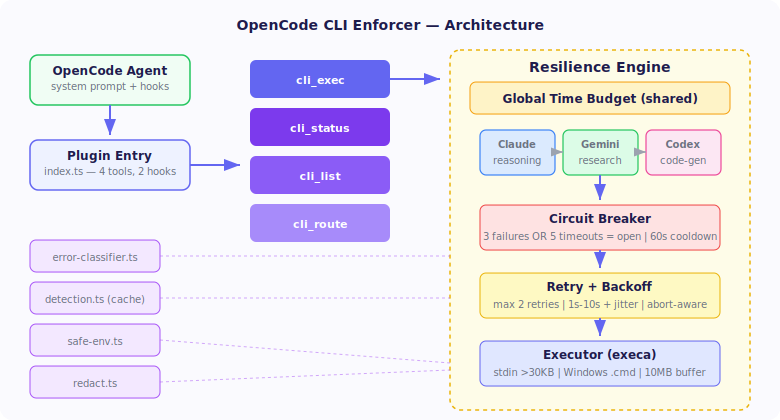
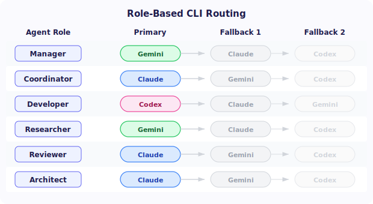
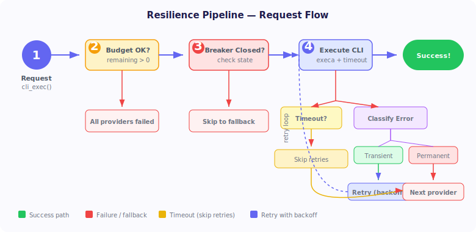
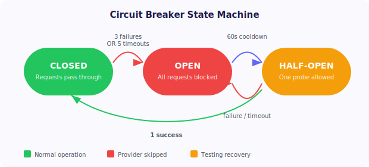

<p align="center">
  
</p>

<h1 align="center">opencode-cli-enforcer</h1>

<p align="center">
  <strong>Resilient multi-LLM CLI orchestration for OpenCode</strong><br>
  <em>Execute Claude, Gemini &amp; Codex with circuit breakers, smart retry, automatic fallback, and role-based routing.</em>
</p>

<p align="center">
  <a href="https://github.com/lleontor705/opencode-cli-enforcer/actions/workflows/ci.yml"></a>
  <a href="https://www.npmjs.com/package/opencode-cli-enforcer"></a>
  <a href="https://github.com/lleontor705/opencode-cli-enforcer/blob/master/LICENSE"></a>
  
  
</p>

---

## Why opencode-cli-enforcer?

Running AI CLIs in production is fragile. Processes timeout, rate limits hit, binaries disappear. Calling three different CLIs means three different failure modes, arg formats, and platform quirks.

**opencode-cli-enforcer** wraps all of that into a single, resilient plugin:

<table>
<tr>
<td width="50%">

**Without this plugin**
- Manual subprocess management
- No retry on transient failures
- One CLI down = entire workflow blocked
- OS-specific arg handling per CLI
- Secrets leak into error logs
- No visibility into CLI health

</td>
<td width="50%">

**With this plugin**
- 4 tools, zero boilerplate
- Exponential backoff + jitter retry
- Automatic fallback chain across providers
- Cross-platform (Windows `.cmd` shims, PATH augmentation)
- Secret redaction on all output
- Real-time health dashboard

</td>
</tr>
</table>

---

## Architecture

<p align="center">
  
</p>

```
cli_exec(prompt)
  |
  v
+----------------------------------------------------------+
|                  Resilience Engine                        |
|                                                          |
|  Global Time Budget (shared across ALL attempts)         |
|  +---------+     +---------+     +---------+             |
|  | Claude  | --> | Gemini  | --> | Codex   |  fallback   |
|  +---------+     +---------+     +---------+  chain      |
|       |               |               |                  |
|       v               v               v                  |
|  [Circuit Breaker] -----> [Retry w/ Backoff] --> [execa] |
|  3 failures = open        max 2 retries          10MB    |
|  5 timeouts = open        1s-10s + jitter        buffer  |
|  60s cooldown             abort-aware sleep               |
+----------------------------------------------------------+
```

---

## Quick Start

### 1. Install as OpenCode plugin (recommended)

Add to your OpenCode configuration:

```json
{
  "plugin": ["opencode-cli-enforcer@latest"]
}
```

### 2. Install via npm / bun

```bash
bun add opencode-cli-enforcer
# or
npm install opencode-cli-enforcer
```

### 3. Prerequisites

You need at least **one** CLI installed and authenticated:

| CLI | Install | Auth |
|-----|---------|------|
| [Claude Code](https://docs.anthropic.com/en/docs/claude-code) | `npm i -g @anthropic-ai/claude-code` | `claude login` |
| [Gemini CLI](https://github.com/google-gemini/gemini-cli) | `npm i -g @anthropic-ai/gemini-cli` | `gcloud auth login` |
| [Codex CLI](https://github.com/openai/codex) | `npm i -g @openai/codex` | `codex auth` |

---

## Tools Reference

### `cli_exec` — Execute with full resilience

The primary tool. Sends a prompt to a CLI with automatic retry, circuit breaker protection, and fallback.

```typescript
cli_exec({
  cli: "claude",
  prompt: "Explain the observer pattern with a TypeScript example",
  mode: "generate",           // "generate" | "analyze"
  timeout_seconds: 300,       // Global budget: 10-1800s
  allow_fallback: true        // Try gemini/codex on failure
})
```

| Parameter | Type | Default | Description |
|-----------|------|---------|-------------|
| `cli` | `"claude" \| "gemini" \| "codex"` | *required* | Primary CLI provider |
| `prompt` | `string` | *required* | Prompt to send (max 100KB) |
| `mode` | `"generate" \| "analyze"` | `"generate"` | `analyze` enables file reads (Claude only) |
| `timeout_seconds` | `number` | `720` | Global timeout budget in seconds |
| `allow_fallback` | `boolean` | `true` | Auto-fallback to alternative providers |

**Response:**

```jsonc
{
  "success": true,
  "cli": "claude",
  "stdout": "The Observer pattern is a behavioral design pattern...",
  "stderr": "",
  "duration_ms": 4523,
  "timed_out": false,
  "used_fallback": false,
  "fallback_chain": ["claude"],
  "error": null,
  "error_class": null,           // "transient" | "rate_limit" | "permanent" | "crash"
  "circuit_state": "closed",     // "closed" | "open" | "half-open"
  "attempt": 1,
  "max_attempts": 3
}
```

---

### `cli_status` — Health dashboard

Returns real-time health for all providers: installation status, circuit breaker state, and usage statistics.

```typescript
cli_status({})
```

**Response:**

```jsonc
{
  "platform": "windows",
  "detection_complete": true,
  "retry_config": { "max_retries": 2, "base_delay_ms": 1000, "max_delay_ms": 10000 },
  "breaker_config": { "failure_threshold": 3, "timeout_threshold": 5, "cooldown_seconds": 60 },
  "providers": [
    {
      "name": "claude",
      "installed": true,
      "path": "/usr/local/bin/claude",
      "version": "1.0.16",
      "circuit_breaker": {
        "state": "closed",
        "consecutive_failures": 0,
        "consecutive_timeouts": 0,
        "total_executions": 12,
        "total_failures": 1,
        "total_timeouts": 0
      },
      "usage": {
        "total_calls": 12,
        "success_rate": "92%",
        "avg_duration_ms": 3400
      },
      "fallback_order": ["gemini", "codex"]
    }
    // ... gemini, codex
  ]
}
```

---

### `cli_list` — List installed providers

Quick check of which CLIs are available on the system.

```typescript
cli_list({})
```

**Response:**

```jsonc
{
  "installed_count": 2,
  "providers": [
    { "provider": "claude", "path": "/usr/local/bin/claude", "version": "1.0.16", "strengths": ["reasoning", "code-analysis", "debugging", "architecture", "planning"] },
    { "provider": "gemini", "path": "/usr/local/bin/gemini", "version": "0.1.8", "strengths": ["research", "trends", "knowledge", "large-context", "web-search"] }
  ]
}
```

---

### `cli_route` — Role-based routing

Recommends the best CLI for a task based on agent role. Considers both provider strengths and real-time availability.

```typescript
cli_route({
  role: "developer",
  task_description: "Refactor the auth module to use JWT"
})
```

| Parameter | Type | Description |
|-----------|------|-------------|
| `role` | `"manager" \| "coordinator" \| "developer" \| "researcher" \| "reviewer" \| "architect"` | Agent role |
| `task_description` | `string?` | Optional context |

**Routing table:**

<p align="center">
  
</p>

| Role | Primary CLI | Reasoning |
|------|------------|-----------|
| **Manager** | Gemini | Research, trends, large-context analysis |
| **Coordinator** | Claude | Reasoning, planning, decision-making |
| **Developer** | Codex | Code generation, refactoring, full-auto |
| **Researcher** | Gemini | Knowledge synthesis, web search |
| **Reviewer** | Claude | Code analysis, debugging, quality |
| **Architect** | Claude | System design, architecture planning |

**Response:**

```jsonc
{
  "role": "developer",
  "task_description": "Refactor the auth module to use JWT",
  "recommended_cli": "codex",
  "reasoning": "Role \"developer\" maps to codex (code-generation, edits, refactoring, full-auto).",
  "fallback_chain": ["codex", "claude", "gemini"],
  "availability": { "codex": true, "claude": true, "gemini": false }
}
```

---

## Resilience Pipeline

<p align="center">
  
</p>

### Global Time Budget

Unlike per-attempt timeouts, the **global time budget** is shared across ALL retries and ALL fallback providers. This prevents timeout multiplication:

```
Traditional:  3 providers x 3 attempts x 300s timeout = 2700s worst case
This plugin:  300s total budget across everything       =  300s worst case
```

Each attempt receives the **remaining** seconds, not the full budget. When the budget runs out, execution stops immediately.

### Circuit Breaker

Per-CLI failure isolation with **separate thresholds** for failures and timeouts (because slow ≠ broken):

<p align="center">
  
</p>

| State | Behavior | Transition |
|-------|----------|------------|
| **Closed** | Normal operation, requests pass through | 3 failures OR 5 timeouts &rarr; Open |
| **Open** | All requests blocked, provider is skipped | After 60s cooldown &rarr; Half-Open |
| **Half-Open** | One probe request allowed | Success &rarr; Closed / Failure &rarr; Open |

### Retry with Exponential Backoff

```
Attempt 0:  immediate
Attempt 1:  ~1s  + jitter (+-30%)
Attempt 2:  ~2s  + jitter (+-30%)
            capped at 10s max
```

- **Transient errors** (network, socket): standard retry
- **Rate limits** (429, quota): retry with 3x longer delay
- **Process timeouts**: skip retries entirely, move to next provider
- **Permanent errors** (auth, 401/403): skip retries, move to fallback
- **Crash** (SIGKILL, ENOENT): skip retries, move to fallback

### Error Classification

```
Error arrives
  |
  +-- exitCode 137 / SIGKILL / ENOENT ---------> CRASH      (no retry)
  +-- 429 / "rate limit" / "quota" -------------> RATE_LIMIT (retry, 3x delay)
  +-- 401 / 403 / "auth" / "not found" --------> PERMANENT  (no retry)
  +-- everything else --------------------------> TRANSIENT  (retry)
```

### Fallback Chain

When a provider fails, the next one in the chain takes over automatically:

```
Claude ---[fail]---> Gemini ---[fail]---> Codex
Gemini ---[fail]---> Claude ---[fail]---> Codex
Codex  ---[fail]---> Claude ---[fail]---> Gemini
```

---

## Cross-Platform Support

<table>
<tr>
<th>Feature</th>
<th>Windows</th>
<th>macOS / Linux</th>
</tr>
<tr>
<td>Binary detection</td>
<td><code>where</code></td>
<td><code>which</code></td>
</tr>
<tr>
<td><code>.cmd/.bat</code> shims</td>
<td>Auto-wrapped with <code>cmd /c</code></td>
<td>N/A</td>
</tr>
<tr>
<td>PATH augmentation</td>
<td>npm, scoop, cargo, pnpm dirs</td>
<td>Standard PATH</td>
</tr>
<tr>
<td>Large prompts (&gt;30KB)</td>
<td colspan="2" align="center">Delivered via <code>stdin</code> to avoid OS arg-length limits</td>
</tr>
<tr>
<td>Environment</td>
<td colspan="2" align="center">Allowlisted vars only (no secrets leak to subprocesses)</td>
</tr>
</table>

### Detection Caching

CLI availability is cached for **5 minutes** to avoid repeated filesystem lookups. The cache covers:
- Binary path resolution
- Version detection
- Both positive and negative results

---

## Security

| Protection | Description |
|-----------|-------------|
| **Secret redaction** | API keys (`sk-*`, `key-*`, `AIza*`, `ant-api*`) and Bearer tokens stripped from all output |
| **Environment filtering** | Only system essentials + proxy vars passed to subprocesses. No API keys — CLIs handle their own auth. |
| **Input isolation** | Large prompts (>30KB) delivered via stdin, not shell args |
| **No shell interpolation** | All CLI execution via `execa` (no `shell: true`) |

---

## Examples

### Basic: Ask Claude to review code

```typescript
const result = await cli_exec({
  cli: "claude",
  prompt: "Review this function for bugs:\n\nfunction add(a, b) { return a - b }",
  mode: "analyze",
  timeout_seconds: 120
})
// result.stdout → "Bug found: the function is named `add` but performs subtraction..."
```

### Fallback: Primary CLI is down

```typescript
// Claude's circuit breaker is open (too many recent failures)
const result = await cli_exec({
  cli: "claude",
  prompt: "Generate a REST API for user management",
  allow_fallback: true
})
// result.cli → "gemini" (automatic fallback)
// result.used_fallback → true
```

### Role routing: Pick the right tool for the job

```typescript
// For a developer task, route to Codex (best at code generation)
const recommendation = await cli_route({
  role: "developer",
  task_description: "Implement pagination for the /users endpoint"
})
// recommendation.recommended_cli → "codex"

// Then execute with the recommended CLI
const result = await cli_exec({
  cli: recommendation.recommended_cli,
  prompt: "Implement pagination for the /users endpoint using cursor-based pagination"
})
```

### Monitor health across providers

```typescript
const status = await cli_status({})

for (const provider of status.providers) {
  console.log(`${provider.name}: ${provider.circuit_breaker.state} | ${provider.usage.success_rate}`)
}
// claude: closed | 95%
// gemini: closed | 88%
// codex: open   | 60%  <-- circuit breaker tripped
```

### Large prompt via stdin

```typescript
const largeCodebase = readFileSync("src/index.ts", "utf-8") // 45KB file
const result = await cli_exec({
  cli: "claude",
  prompt: `Analyze this codebase for security vulnerabilities:\n\n${largeCodebase}`,
  mode: "analyze",
  timeout_seconds: 600
})
// Prompt >30KB → automatically delivered via stdin (no OS arg-length issues)
```

---

## Hooks

The plugin injects two hooks into the OpenCode lifecycle:

### `experimental.chat.system.transform`

Automatically injects CLI availability into the system prompt of every agent (except `orchestrator` and `task_decomposer`), so the LLM knows which tools are available and their current health.

### `tool.execute.after`

Tracks when agents invoke CLIs directly via `bash` instead of using `cli_exec`, incrementing usage counters for observability.

---

## Provider Strengths

<p align="center">
  
</p>

| Provider | Binary | Strengths |
|----------|--------|-----------|
| **Claude** | `claude` | Reasoning, code analysis, debugging, architecture, planning |
| **Gemini** | `gemini` | Research, trends, knowledge, large-context, web search |
| **Codex** | `codex` | Code generation, edits, refactoring, full-auto mode |

---

## Configuration Reference

### Circuit Breaker Defaults

| Parameter | Value | Description |
|-----------|-------|-------------|
| `failureThreshold` | `3` | Consecutive failures before opening |
| `timeoutThreshold` | `5` | Consecutive timeouts before opening (slow ≠ broken) |
| `cooldownMs` | `60000` | Milliseconds before open &rarr; half-open |
| `halfOpenSuccessThreshold` | `1` | Successes in half-open to close |

### Retry Defaults

| Parameter | Value | Description |
|-----------|-------|-------------|
| `maxRetries` | `2` | Maximum retry attempts per provider |
| `baseDelayMs` | `1000` | Base delay for exponential backoff |
| `maxDelayMs` | `10000` | Maximum delay cap |
| `jitterFactor` | `0.3` | Random jitter range (+-30%) |

### Executor Defaults

| Parameter | Value | Description |
|-----------|-------|-------------|
| `STDIN_THRESHOLD` | `30000` | Characters before switching to stdin delivery |
| `MAX_BUFFER` | `10MB` | Maximum stdout/stderr buffer |

---

## Development

```bash
bun install              # Install dependencies
bun test                 # Run all tests (85 tests)
bun test --watch         # Watch mode
bun test tests/retry.test.ts  # Run a single test file
bun run typecheck        # Type-check without emitting
bun run build            # Build
```

### Project Structure

```
src/
  index.ts             Plugin entry, 4 tools, 2 hooks
  resilience.ts        Global time budget, retry + breaker + fallback
  circuit-breaker.ts   Per-CLI state machine (failures + timeouts)
  executor.ts          execa wrapper, Windows handling, PATH augmentation
  cli-defs.ts          Provider configs, arg builders, role routing
  detection.ts         CLI auto-detection with 5-min cache
  retry.ts             Exponential backoff, abort-aware sleep
  error-classifier.ts  Error categorization for retry decisions
  safe-env.ts          Environment variable allowlist
  redact.ts            Secret redaction
  platform.ts          OS detection

tests/
  8 test files, 85 tests covering all modules
```

---

## Contributing

1. Fork the repo
2. Create a feature branch from `develop`: `git checkout -b feat/my-feature develop`
3. Make your changes and add tests
4. Run `bun test` (all 85 must pass)
5. Open a PR to `develop`

---

## License

[MIT](LICENSE) &copy; [lleontor705](https://github.com/lleontor705)
